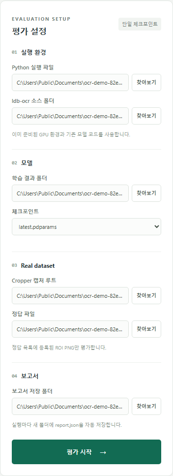
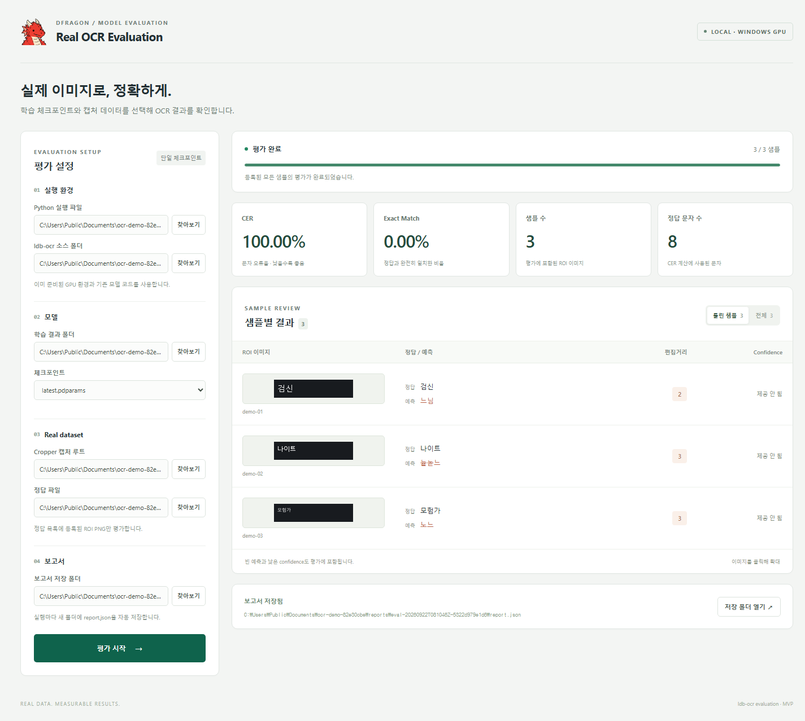
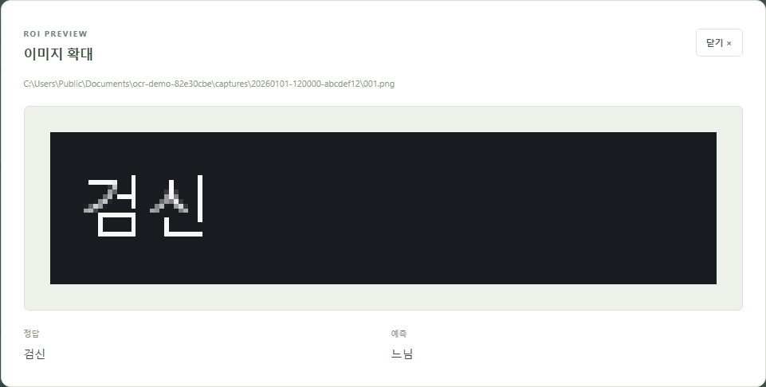

  

<h1 align="center">Real OCR Evaluation</h1>

  체크포인트와 실제 이미지를 선택해 <strong>OCR 정확도와 오답을 확인하는 Windows GPU 앱</strong>입니다.

  <a href="docs/guide.md">실행 안내</a> · <a href="examples/labels.json">labels.json 예제</a>

## 01. 모델과 데이터 선택

  

## 02. 평가 실행 → 정확도와 오답 확인

실제 Windows 앱에서 합성 예제 이미지 3개를 GPU로 평가했습니다. 수치는 사용법 시연용입니다.

## 03. 이미지를 확대해 비교

