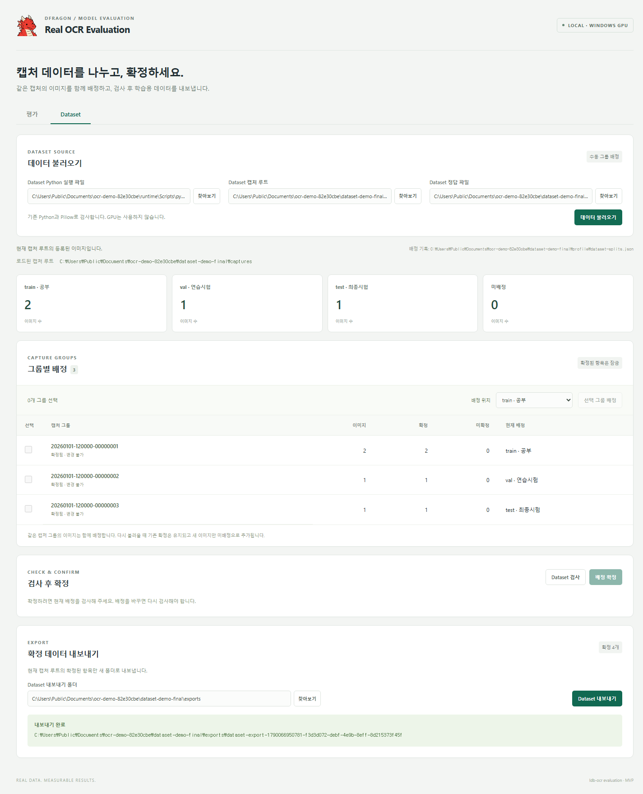
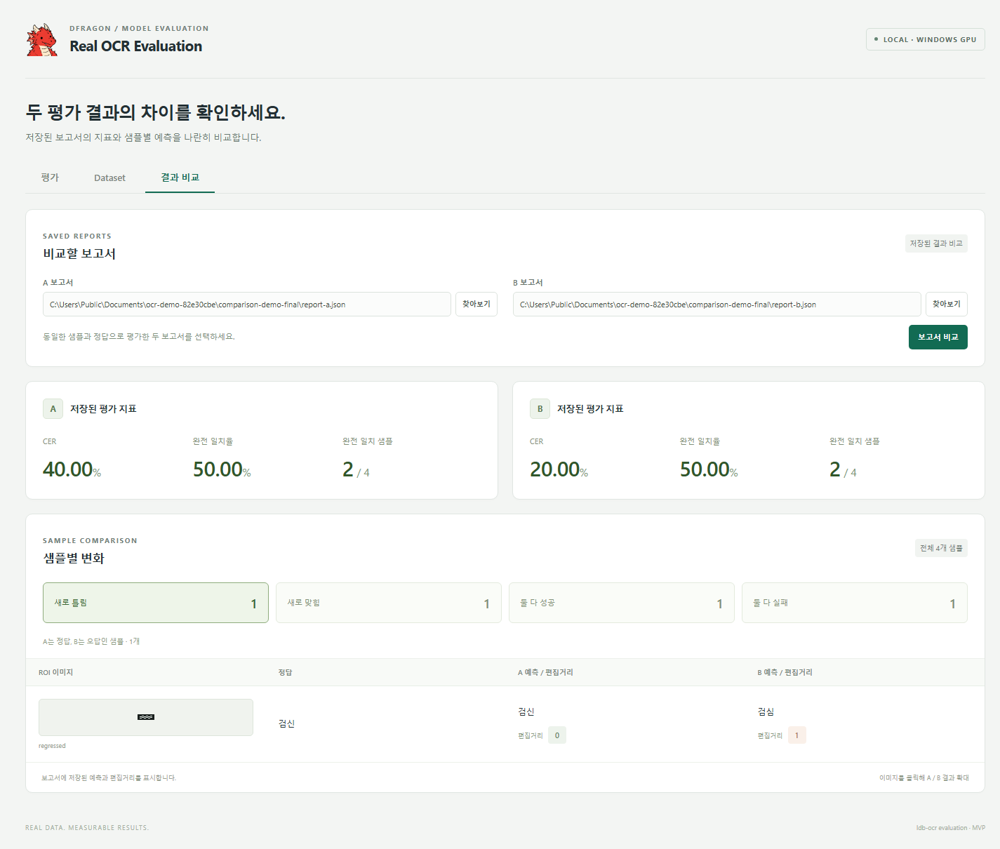
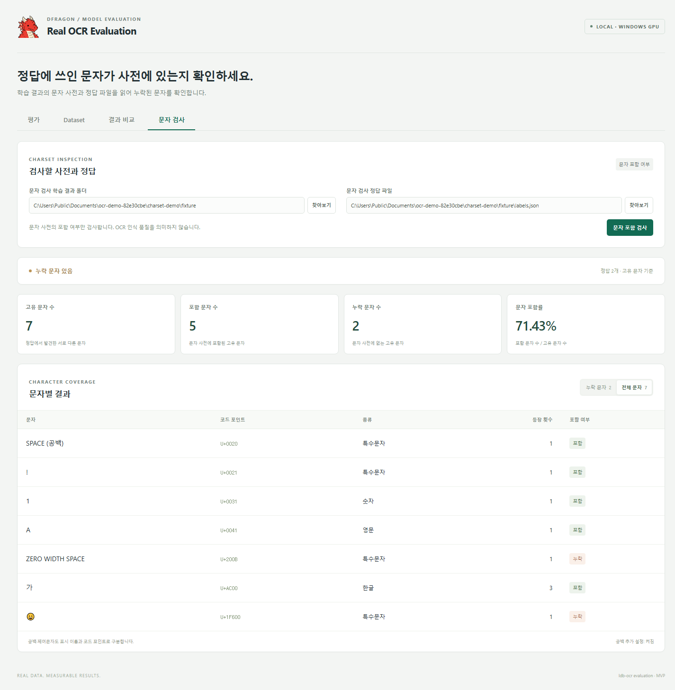

  

<h1 align="center">Real OCR Evaluation</h1>

  캡처 데이터를 나누고, <strong>OCR 정확도와 오답을 확인하는 Windows 앱</strong>입니다.

  <a href="docs/guide.md">실행 안내</a> · <a href="docs/dataset.md">Dataset 나누기</a> · <a href="docs/comparison.md">결과 비교</a> · <a href="docs/charset.md">문자 검사</a>

## 01. 모델과 데이터 선택

  

## 02. 평가 실행 → 정확도와 오답 확인

실제 Windows 앱에서 합성 예제 이미지 3개를 GPU로 평가했습니다. 수치는 사용법 시연용입니다.

## 03. 이미지를 확대해 비교

## 04. Dataset을 train / val / test로 나누기

캡처 묶음 선택 → 직접 배정 → 검사 → 확정 → 목록 저장. Windows 앱에서 예제 PNG로 확인한 화면입니다.

## 05. 두 보고서의 성적과 샘플 비교

A 보고서 → B 보고서 → 비교. 고정 예제 보고서를 Windows 실제 앱에서 연 화면입니다.

## 06. 사전에서 빠진 문자 확인

학습 결과 폴더 → labels.json → 문자 검사. Windows 실제 앱에서 고정 예제의 문자 빈도·포함률을 확인한 화면입니다.

