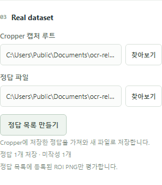

# Cropper 정답을 labels.json으로 변환

Cropper의 **Ground Truth** 탭에서 저장한 정답을 평가용 목록으로 옮깁니다. PNG와 `metadata.json`, `.bak`는 변경하지 않습니다. OCR·GPU·추가 Python 패키지를 사용하지 않습니다.

## 앱에서 사용

1. **평가** 탭에서 **Cropper 캡처 루트**를 선택합니다.
2. 정답 파일 아래의 **정답 목록 만들기**를 누릅니다.
3. 새 JSON 파일을 저장할 위치와 이름을 선택합니다.
4. 생성된 파일이 **정답 파일**에 자동으로 선택됩니다. 정답 수와 미작성 ROI 수도 표시됩니다.

모델·체크포인트·GPU는 필요하지 않습니다. 앱이 설치된 Python을 찾아 내부 변환기를 실행하므로 `.py` 파일이나 명령어를 직접 실행하지 않아도 됩니다. Python 3.10 이상이 필요하며, 이미 선택한 실행 환경이 있으면 그 환경을 사용합니다.

이미 `labels.json`이 있는 폴더에서는 새 이름을 제안합니다. 기존 파일을 선택해도 덮어쓰지 않으며, 저장 창 취소나 변환 실패 시 기존 정답 파일 선택은 유지됩니다. 생성된 파일은 그대로 두고 선택 설정 저장에만 실패한 경우에는 오류를 표시합니다.

## 변환 규칙

- 각 이벤트의 현재 `metadata.json`에서 `groundTruth.schemaVersion: 1`과 `groundTruth.regions`를 읽습니다. `.bak`는 사용하지 않습니다.
- `regions`의 ROI ID로 정답과 PNG를 연결합니다. 출력 `id`는 `이벤트ID/ROI번호`, `image`는 `이벤트ID/ROI번호.png`입니다.
- 정답 문자열의 공백과 Unicode를 그대로 보존합니다. Cropper에서 미작성으로 취급하는 필드 누락·`null`·빈 문자열·공백만 있는 값은 미등록 개수로 알리고 내보내지 않습니다.
- 잘못된 형식, 알 수 없는 ROI, 등록된 이미지 누락·잘못된 PNG 헤더·크기 불일치는 전체 변환을 실패시킵니다. 기존 평가 로더의 경로·metadata·PNG 헤더 검사를 재사용하며, 모델 입력 가능 여부나 PNG 전체 디코딩을 이 단계에서 보증하지 않습니다.
- 정답이 하나도 없으면 파일을 만들지 않습니다. 먼저 Cropper에서 정답을 저장하세요.

이미지·정답·모델을 자동 생성하거나 수정하는 기능은 없습니다. 앱 버튼은 v0.1.2부터 제공됩니다.

Cropper의 [정답 저장 형식](https://github.com/blahaj94/dfragon-cropper/blob/main/docs/ground-truth.md)과 현재 `readAnswers` 구현을 기준으로 변환합니다. 변환기의 Python 테스트 80개에 더해, 앱 연결 후 lint·format·typecheck·build, Vitest 109개, Playwright 35개를 통과했습니다. 실제 Windows 패키지에서 버튼으로 예제와 실제 캡처를 변환하고 자동 선택·재시작 후 복원·저장 취소·기존 파일 덮어쓰기 거부·원본 보존을 확인했습니다. GPU 추론은 실행하지 않았습니다.
